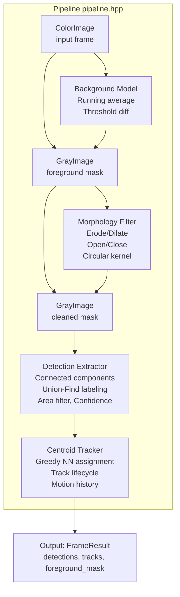
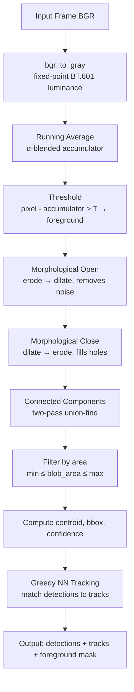

# imgpipeline — Image Detection & Tracking Pipeline

A C++ image-processing and multi-target detection pipeline, developed as a translation of a Python/OpenCV prototype into optimized, dependency-free C++. The project implements background subtraction, morphological filtering, connected-component labeling, and centroid-based object tracking from scratch.

## Motivation

Research prototypes for image detection are often written in Python with NumPy/OpenCV for quick iteration. When those algorithms need to run at real-time rates on constrained hardware (embedded sensors, space-based platforms), a native C++ implementation becomes necessary. This project demonstrates that translation workflow end-to-end:

1. A working **Python prototype** (`python_prototype/detector.py`) defines the algorithm
2. The **C++ implementation** (`src/`, `include/`) replicates the same logic with manual memory control, zero external dependencies, and opportunities for SIMD/GPU acceleration
3. A **benchmark harness** measures throughput, latency percentiles, and allows direct comparison between the two

## Architecture



### Data Flow



### Module Breakdown

| Module | Header | Source | Corresponds to (Python) |
|--------|--------|--------|------------------------|
| Types & structs | `include/types.hpp` | — | `Detection`, `Track` classes |
| Background subtraction | `include/background_model.hpp` | `src/background_model.cpp` | `BackgroundModel` |
| Morphological filtering | `include/morphology.hpp` | `src/morphology.cpp` | `MorphologyFilter` |
| Detection extraction | `include/detection_extractor.hpp` | `src/detection_extractor.cpp` | `DetectionExtractor` |
| Object tracking | `include/tracker.hpp` | `src/tracker.cpp` | `CentroidTracker` |
| Pipeline orchestrator | `include/pipeline.hpp` | `src/pipeline.cpp` | `DetectionPipeline` |
| Image I/O (PPM/PGM) | `include/image_io.hpp` | `src/image_io.cpp` | — |

## Directory Structure

```
imgpipeline/
├── CMakeLists.txt
├── README.md
├── .gitignore
├── include/
│   ├── types.hpp                 # shared data structures
│   ├── background_model.hpp      # background subtraction
│   ├── morphology.hpp            # morphological operations
│   ├── detection_extractor.hpp   # connected-component detection
│   ├── tracker.hpp               # centroid-based tracker
│   ├── pipeline.hpp              # top-level pipeline
│   └── image_io.hpp              # PPM/PGM reader/writer
├── src/
│   ├── background_model.cpp
│   ├── morphology.cpp
│   ├── detection_extractor.cpp
│   ├── tracker.cpp
│   ├── pipeline.cpp
│   ├── image_io.cpp
│   └── main.cpp                  # demo program
├── tests/
│   └── test_pipeline.cpp         # 17 unit tests
├── benchmarks/
│   └── benchmark_pipeline.cpp    # performance profiling
├── python_prototype/
│   └── detector.py               # original Python implementation
├── scripts/
│   └── build_and_test.sh         # one-step build + test + benchmark
└── output/                       # generated by demo (gitignored)
```

## Building

**Requirements:** CMake ≥ 3.14, C++17 compiler (GCC 9+, Clang 10+). No external libraries needed for the C++ pipeline.

```bash
# quick build
mkdir build && cd build
cmake .. -DCMAKE_BUILD_TYPE=Release
make -j$(nproc)

# or use the convenience script
./scripts/build_and_test.sh
```

### Build Targets

| Target | Description |
|--------|-------------|
| `imgpipeline_demo` | Runs pipeline on synthetic data, writes PPM/PGM output |
| `test_pipeline` | Unit test suite (17 tests) |
| `benchmark_pipeline` | Performance benchmark with latency percentiles |

### Optional: Profiling Build

```bash
cmake .. -DENABLE_PROFILING=ON
make -j$(nproc)
./benchmark_pipeline
gprof benchmark_pipeline gmon.out > profile.txt
```

## Running

### Unit Tests

```bash
./build/test_pipeline
```

Expected output: all 17 tests should report `OK`.

### Demo

```bash
./build/imgpipeline_demo [output_dir]
```

Generates 60 frames of synthetic moving targets with detection overlays. Output is written as PPM (color) and PGM (grayscale) files.

### Benchmark

```bash
./build/benchmark_pipeline [width] [height] [num_frames]
# defaults: 640 480 500
```

Reports average frame time, throughput in FPS, and P50/P95/P99 latency.

### Python Prototype

```bash
pip install numpy opencv-python-headless
python3 python_prototype/detector.py
```

Runs the same benchmark on synthetic data using the original Python implementation for comparison.

## Design Decisions

**Zero external dependencies (C++ side).** The pipeline implements background subtraction, morphological operations, and connected-component labeling from scratch. This makes the code easy to audit, port to embedded targets, and extend with SIMD or GPU kernels without worrying about library version conflicts.

**PPM/PGM for I/O.** These formats are trivially simple to parse and write, which keeps the image I/O code small and portable. For production use, swap in `stb_image` or `libpng`.

**Union-find for connected components.** The two-pass algorithm with path compression and union by rank is textbook-correct, cache-friendly (operates on a flat label array), and easy to verify. Scaling to large images may benefit from a parallel variant.

**Greedy nearest-neighbor tracking.** Matches the Python prototype's logic directly. For scenes with frequent occlusions or crossing trajectories, this should be upgraded to the Hungarian algorithm — the tracker interface is designed to make that swap straightforward.

## Potential Extensions

- **CUDA acceleration:** The background subtraction and morphology stages are embarrassingly parallel. A CUDA kernel for the per-pixel running average + threshold would bring the pipeline well into real-time territory for high-resolution inputs.
- **SIMD intrinsics:** The inner loops in `background_model.cpp` and `morphology.cpp` are good candidates for SSE/AVX vectorization, especially the luminance conversion and threshold operations.
- **Hungarian assignment:** Replace the greedy tracker with a proper optimal assignment solver for better handling of occlusions.
- **Video I/O:** Add FFmpeg or V4L2 integration for processing live camera feeds or video files.
- **Config file:** Load `PipelineConfig` from a YAML or JSON file instead of hardcoding defaults.

## Testing

The test suite covers every pipeline component:

- **Image types:** construction, pixel access, channel layout
- **Background model:** initialization, convergence, change detection
- **Morphology:** erosion shrinks regions, dilation expands, noise removal
- **Detection extractor:** single blob, multiple blobs, area filtering, centroid accuracy
- **Tracker:** registration, association across frames, track removal, multi-target
- **Full pipeline:** end-to-end detection on synthetic input
- **Image I/O:** PPM and PGM round-trip integrity

## License

MIT
